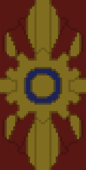

<p align="center"></p>

<h1 align="center">ModRealms Launcher</h1>

<em><h5 align="center"><a href="https://github.com/dscalzi/HeliosLauncher">Modified from HeliosLauncher</a></h5></em>

<!-- [<p align="center">](https://travis-ci.org/dscalzi/HeliosLauncher) [](https://github.com/dscalzi/HeliosLauncher/releases) </p> -->

<p align="center">Join ModRealms' servers easily and keep up to date with our packs and fixes!</p>

## Downloads

You can download from [GitHub Releases](https://github.com/dscalzi/HeliosLauncher/releases)

## Development (ModRealms fork)

All ModRealms-specific changes (UI, assets, default configuration, etc..) will be in the master branch.

A development branch __mr-features__ will be used to work on new additions to the core mechanics of the original project (as below) and will keep up to date with the original project. We may submit features from this branch as a PR to the original project.


#### Latest Release
Coming Soon!
<!-- [](https://github.com/dscalzi/HeliosLauncher/releases/latest) -->

**Supported Platforms**

If you download from the [Releases](https://github.com/ModRealms-Network/HeliosLauncher/releases) tab, select the installer for your system.

| Platform | File |
| -------- | ---- |
| Windows x64 | `helioslauncher-setup-VERSION.exe` |
| macOS | `helioslauncher-VERSION.dmg` |
| Linux x64 | `helioslauncher-VERSION-x86_64.AppImage` |

## Console

To open the console, use the following keybind.

```console
ctrl + shift + i
```

Ensure that you have the console tab selected. Do not paste anything into the console unless you are 100% sure of what it will do. Pasting the wrong thing can expose sensitive information.

#### Export Output to a File

If you want to export the console output, simply right click anywhere on the console and click **Save as..**


## Help

For help regarding this version (ModRealms' fork), contact the staff on the discord server below:

[][discord]


## Original Authors

This project is forked from HeliosLauncher, a project by dscalzi for the server WesterosCraft. Please visit and support their project at the links below!

* [Project Link][original]
* [Original Project Wiki][wiki]
* [Aventium Softworks Discord][discord2]

[discord]: https://discord.gg/tKKeTdc 'ModRealms Discord'
[discord2]: https://discord.gg/zNWUXdt 'Original Project Discord'
[original]: https://github.com/dscalzi/HeliosLauncher 'Original Project GitHub'
[wiki]: https://github.com/dscalzi/HeliosLauncher/wiki 'wiki'